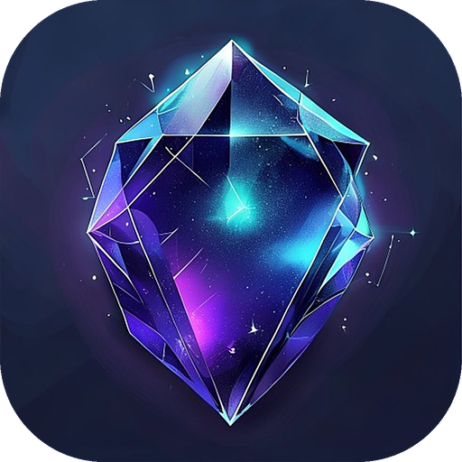
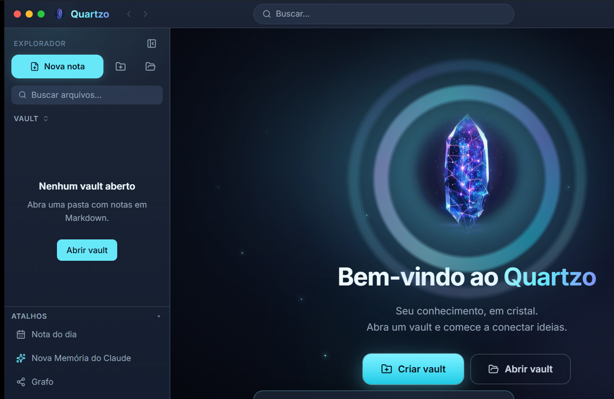
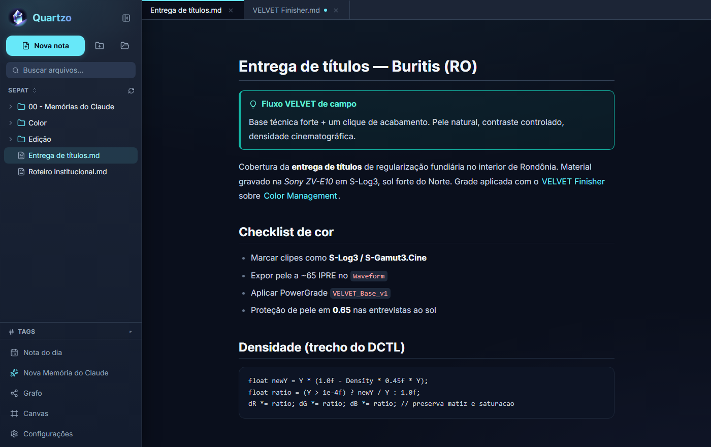
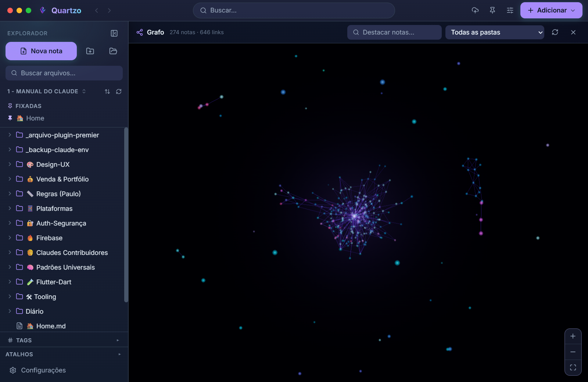

# Quartzo

**Seu segundo cérebro em Markdown — local-first, rápido e 100% offline. Suas notas são seus arquivos, na sua máquina, pra sempre.**

---

Quartzo é um app de conhecimento pessoal (PKM) **local-first** no espírito do Obsidian: você escreve em **Markdown**, conecta ideias com `[[wikilinks]]`, visualiza o **grafo** da sua base, desenha no **canvas** e volta a qualquer nota pelos **backlinks**. Sem nuvem obrigatória, sem conta, sem servidor entre você e o seu texto.

## ✨ Por que Quartzo

- 🗂️ **Suas notas são seus arquivos.** Tudo vira `.md` de texto puro na *sua* pasta — nada de formato fechado, nada de banco proprietário. Abre no Quartzo hoje, no bloco de notas daqui a 10 anos.
- 🔌 **100% offline, sem conta.** Abre sem internet, salva sozinho no disco. Seus dados nunca saem da sua máquina a menos que *você* mande.
- 🕸️ **Grafo, canvas e backlinks.** Veja como suas ideias se conectam numa rede neural 2D — cada pasta vira uma região colorida — desenhe no canvas infinito e navegue por tudo que aponta pra nota atual.
- ⚡ **Busca instantânea.** Encontre qualquer nota em milissegundos, mesmo com milhares de arquivos — indexação nativa em Rust.
- ✍️ **Editor de verdade.** CodeMirror 6 em três modos (edição / dividido / leitura), `[[wikilinks]]`, transclusão `![[nota]]`, tags, views dinâmicas (tabela / kanban / tarefas), Mermaid e KaTeX.
- 🕘 **Histórico de versões local.** Git nativo por baixo — volte no tempo sem depender de nuvem nenhuma.
- 🎨 **Claro e escuro, ambos de primeira.** Identidade cristalina: violeta `#A78BFA` com brilho ciano `#67E8F9`, sobre navy. Ambos os temas nascem prontos.
- 💾 **Sync com Google Drive** *(Pro)* e **export DOCX / PDF / HTML** *(Pro)* — quando você quiser levar pra fora.
- 🖥️ **Windows e macOS** — build universal (Intel + Apple Silicon).

  
  

## 💎 Núcleo grátis, Pro perpétuo

Quartzo é **open-core**: o núcleo é grátis pra sempre e o Pro é uma **compra única**.

| | Grátis (pra sempre) | Pro |
|---|:---:|:---:|
| Editor Markdown (3 modos) | ✅ | ✅ |
| Grafo · Canvas · Backlinks | ✅ | ✅ |
| Busca instantânea offline | ✅ | ✅ |
| `[[wikilinks]]` · tags · views · Mermaid · KaTeX | ✅ | ✅ |
| Temas claro / escuro | ✅ | ✅ |
| Versões locais (Git nativo) | ✅ | ✅ |
| **Sync com Google Drive** | — | ✅ |
| **Export DOCX / PDF / HTML** | — | ✅ |
| **Temas-gema extras** | — | ✅ |

### ➡️ [Comprar Quartzo Pro — R$ 150](https://paulocodex.com/comprar?product=quartzo)

**Licença vitalícia. Sem mensalidade. Pague no site, receba a chave por email, cole no app — é seu pra sempre.**

## 🆚 Quartzo vs. Obsidian

O Obsidian é ótimo — e o Quartzo compartilha a mesma alma local-first: **suas notas são arquivos `.md`, no seu disco, sem lock-in.** A diferença está no modelo:

- **Compra única, não assinatura.** O sync e o export oficiais do Obsidian são *mensalidades* (Sync/Publish). No Quartzo, sync com Drive e export são **um pagamento só, perpétuo**.
- **Preço honesto.** Uma licença cobre tudo. Sem cobrança recorrente pra sincronizar suas próprias notas.
- **Leve e nativo.** Núcleo em Rust (Tauri) — abre rápido, ocupa pouco, e não é um navegador disfarçado.
- **Mesma liberdade de dados.** Texto puro na sua pasta. Se um dia você quiser sair, seus arquivos já estão lá, legíveis, sem exportador nenhum.

> Migra fácil: aponta o Quartzo pra sua pasta de notas `.md` existente e pronto — seus `[[wikilinks]]` e tags já funcionam.

## 🖥️ Requisitos

- **Windows 10 (build 1809+) ou Windows 11**, ou **macOS** (Intel ou Apple Silicon)
- Sem GPU dedicada, sem internet obrigatória, sem conta

## 👤 Sobre o desenvolvedor

**Paulo Adriel** é produtor de vídeo e desenvolvedor indie brasileiro. Construo o produto **e** a apresentação dele — código + identidade visual, motion e material de lançamento — do zero ao ar em 30 dias. Trabalho de forma aberta e escuto quem usa. Estúdio [**Paulocodex**](https://paulocodex.com).

 

---

📧 [contato@paulocodex.com](mailto:contato@paulocodex.com) &nbsp;·&nbsp; 🌐 [paulocodex.com](https://paulocodex.com) &nbsp;·&nbsp; 📸 [Instagram](https://instagram.com/paulodev.codex) &nbsp;·&nbsp; 💼 [LinkedIn](https://www.linkedin.com/in/paulo-adriel/) &nbsp;·&nbsp; 🐙 [github.com/Paulothedeveloper](https://github.com/Paulothedeveloper)

_Repositório de **apresentação pública** — o código-fonte é fechado. Nada de dado ou segredo aqui._

